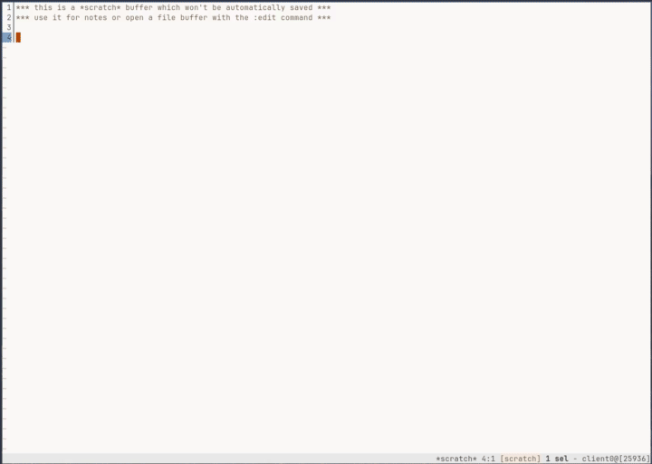

# peneira-filters

Additional custom filters for the [kakoune](http://kakoune.org/) plugin [gustavo-hms/peneira](https://github.com/gustavo-hms/peneira).

## Installation

Via [plug.kak](https://github.com/andreyorst/plug.kak)
```
plug "https://codeberg.org/mbauhardt/peneira-filters" config %{
    map global normal <c-p> ': peneira-filters-mode<ret>'
}
```
This snipped above installs the custom filters and map the keystroke ctrl-p to open the kakoune menu to show the available
keybindings for all the implemented filters.



### Buffer Filter
TBD

### Grep Filter
TBD

### Git Project Filter
TBD

### XDG config files
TBD
