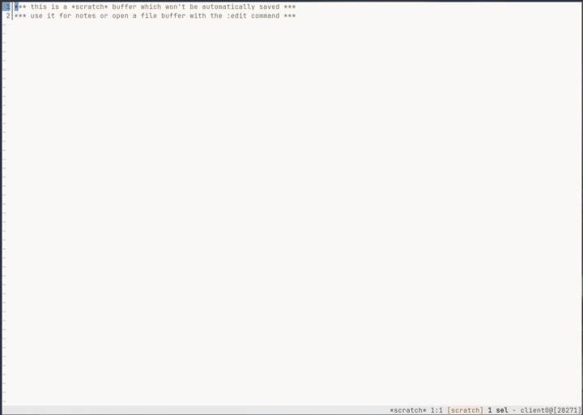
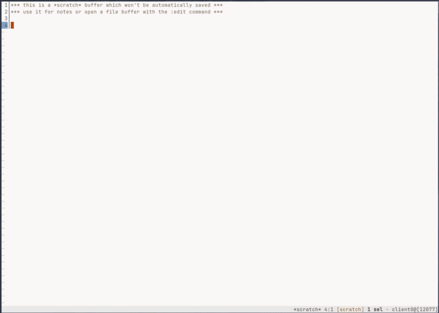
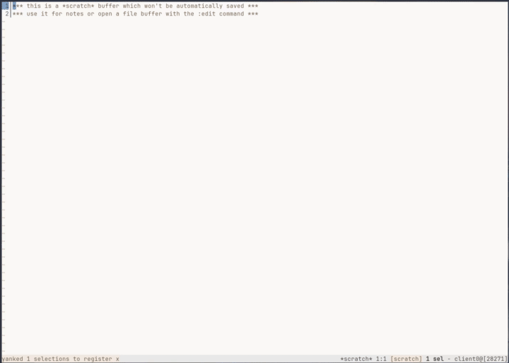

# peneira-filters
Additional custom filters for the [kakoune](http://kakoune.org/) plugin [gustavo-hms/peneira](https://github.com/gustavo-hms/peneira).


## Why
The following functionality or feature set helps me in my daily work to find files I want to edit or just to look into.

- Fixed dir which is my *project/workspace dir*. Basic search starts from there.
- *Search* and open for file by name within my project/workspace with an algorithm which feels convenient for me, I believe in [fzy](https://github.com/jhawthorn/fzy).
- Search and open for file by name starting from the directory of the current open file.
- *Buffer list* with open files. Quick way to search for a specific buffer and switch into.
- Within the current open file, searching a word, *list all lines* with matches and go to this line.
- *Grep* for file contents in my project/workspace recursively, list all files with matches and open when hit enter.
- 

Not required but sometimes helpful

- Shorthand to open a project/workspace.
- Search for OS related config files aka `$XDG_CONFIG_HOME`


## What
- Provide a shorthand to existing [gustavo-hms/peneira](https://github.com/gustavo-hms/peneira) filters. This project provides a great way to hook in your own filters.
- Implement additional filters to achieve the `Why`.


## How

## Installation
Via [plug.kak](https://github.com/andreyorst/plug.kak)
```
plug "https://codeberg.org/mbauhardt/peneira-filters" config %{
    map global normal <c-p> ': peneira-filters-mode<ret>'
}
```

### User Mode
This snipped above installs the custom filters and map the keystroke ctrl-p to open the kakoune menu to show the available
keybindings for all the implemented filters.



### File Filter
This is one of the already implemented filter from [gustavo-hms/peneira](https://github.com/gustavo-hms/peneira). List all files baseed on the `fzy` algorithm.



### Buffer Filter
List of buffer to be able to switch between already opened files.



### Grep Filter
TBD

### Git Project Filter
TBD

### XDG config files
TBD
